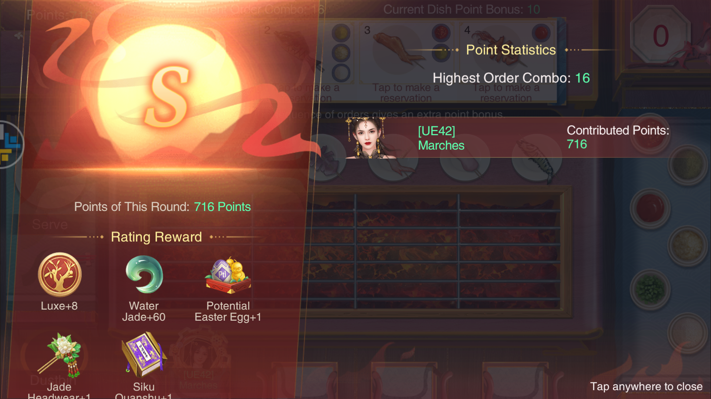

# CME Tips
I am [UE42] Marches, the best player ever. 🎉

## Goal setting
The majority of players will never win an event; this is the reality of a pay-to-win game. Rather than celebrating VIP 10s who win yet again (and lamenting your lack of success), you should set achievable goals that you want to hit (e.g. powering unique ministers, doing well in your favourite events), and celebrate those who hit theirs.

## Alliance Carnival
- When you receive an invite to a Gate, wait to go past Go before you accept it - this lets you skip more of the board, so you get more trips.
   - The rewards for passing Go increase on rounds 10 and 18.

## Art Academy
Calculate how many Painting Boxes you will receive on the third day, and have the sum of that and how many you have remaining on the second day be a multiple of 10 - this means you will spend less time using your boxes on the final day, and so will win the tiebreaker between people who have the same score as you (since the tiebreaker is "who reached that score first?").

For example, a 0.99 recharge + gold Painting Boxes + activeness reward Painting Boxes will give you 17 per day. If you end the second day with 3, you will have 20 on the third day after you gain all of your boxes - this means you can use all of your boxes in two 10x paints. This is faster than the alternative, which would be painting with 17 boxes; one 10x paint, and seven 1x paints.

## Backyard Entertainment
It takes five seconds to cook a single side of fish. The exclamation points appear when it's about to burn, at ten seconds. You are best off counting to five yourself.

## Banquets
For the cost of a gold gift, you could hold a banquet yourself. Only use taels and gift boxes.

## Curiosity
[Curiosity](./curiosity/curiosity.md#curiosity)

## Elite Drill
Play 5x. You gain five times more points, at the cost of dying three times faster. This is a win.

## Guardians
Guardians are most efficient talisman-wise at 3* - it costs 20 to get there, giving a 1% bonus and +5 potential in all stats. The next level costs 40, and provides the same stat increase.

## Go Match
- Open bowls when you get the Go Saint to fish for the 2x point buff.
  - Also worth doing on the second floor Epic, if the bowls will expire before you plan to go to the third floor.
  - If you don't have any bowls, you can mark them and move on - keep killing NPCs until one drops a bowl with a 2x point buff, and then attack your mark to get the buffed points there.
    - Make sure your teammates don't attack marks like these.
- Mind carries over to the second and third day.
  - This means you can open a Jade Bowl to get a 2x buff on the Go Saint, and then use the Mind to skip the first floor the next day.

## Great Auction House
- Only bid on items you are willing to win.
- If you all-in, you sacrifice buying items from the Oddity Shop and Everything Store.

##### Everything Store
- At 45 minutes past the hour, it costs ~340k to buy everything.
- At 50 minutes past the hour, it costs ~130k to buy everything.

## Hetu Ala (Attacker)
After you fire the cannon, go back to the previous screen and back in. This is faster than waiting for the cannon animation to play, which will allow you to shoot more before the wall goes down.

## Local Events
Are only good for Kun talismans - CS events give better rewards, and season points for your investment.

## Loulan Siege
It costs nothing to deploy a defence team to an altar, and at least one stamina for an attacker to remove it. If an enemy nation starts attacking your altar, let them burn stamina killing defence teams that you can replenish for free.

## Mansions
You've probably already messed them up. For such a permanent mechanic, it is explained very poorly.

## Mohist Maze
#### Red Burrs
[Where do Red Burrs appear?](./mohist-maze/red-burr-location.md#where-do-red-burrs-appear)

## Naadam Fair
- To calculate a minister's CP during Loot: `[Your minister's CP] / ( [% damage you did] / 100 )`

## Penglai Island Domination
- If you want to go to the third map at the start of the day, go ASAP and pop Dragon Compasses as fast as you can. While you are the only player up there, the player target will be a weak NPC. 
  - Make sure you have a decent number of nation members to ransom your ministers back when stronger players come and smash you up.
- Otherwise, go as late as possible (i.e. hit 25/30 stamina with all your gold left) so you get a good spread of players and are less likely to get players you can't one-shot.

## Power

#### When to power
Power at any time you need it, including outside of power-increase events. If you're weak, getting power _now_ will help you rank higher during power events (e.g. Penglai), meaning you get more rewards.

The Power Increase expiring event provides good items, and is worth considering.

Ideally don't use Potential Fruit outside of CS Power/Talent due to the loss of season points. Boosts that don't count towards Talent (e.g. Guardians, Consort influence) are best used for these.

#### Who to power
Some amount of minister spread is nice to make good use of resources that can only be used on certain ministers. To this end, you should aim to have at least:
- One strong Heroine
  - To receive Heroine souls.
- One strong Excellent
  - To receive blue Guardians.
- One strong Epic
  - To receive purple Guardians.
- One strong Fu Hao/Mi Yue/Zhongli Chun
   - To enhance with their shared Soul box.

## Recharging
If there were no VIP 0s, there would be no game because rechargers would only have other rechargers to compete with, and no one to flex their 50b power on. Don't snipe someone who's spent six months scrounging a hoard together to try and get a PM.

If there were no rechargers, there would be no game because someone has to pay for everything. Don't complain about rechargers winning the majority of events; you signed up for a P2W game.

## Sea Fishing
- Use something to draw a straight line on your screen to help with aiming.
  - If you can't find anything, just throw your phone at the floor really hard so the screen cracks and then use those for lines.
- Save all the consumables (bar Fragrant Pollen since you can get a lot of those) for a single run on the final day, to maximise your Single Round ranking.
- If you exit a map, the fish will be reset to starting positions but your hook will remain in the same place.
  - This is useful if your hook and a fish accidentally syncronise, and you don't want to use a Fragrant Pollen.
- You gain substantially more points in later areas than you do in the earlier ones - getting through areas is key to a high ranking.
  - The first area will give you 1,400 points if played perfectly. Later areas have 1 durability catchables that are worth 1,300 points.
- Fragrant Pollens carry over between areas, so be careful with using them when your durability is running low.

## Sea Voyage
- Good items (Jade and Silk) come at around turn 11. By that point, you want to be at 150 capacity.
- The city you visit on your final turn will always buy everything you have to sell.

## Season
The event rotation is, more-or-less:
|Boost Event|Event|Mini-game|
|--|--|--|
|Curiosity|Palace Green Ware|Fishing|
||Naadam Fair|Alliance Carnival|
|Intimacy|Penglai|Jade for Beauty|
|Savvy|Mohist Maze|Palace Cuju|
|Power|CS Siege|Elite Drill|
|Curiosity|Loulan Dominion|
||Naadam Fair|Imperial Feast|
|Intimacy|Penglai Forest|Jade for Beauty|
|Savvy|Go Match|Palace Cuju|
|Talent|Loulan Siege|Elite Drill|

The boost events very rarely change, but the events can sometimes be different - CS Siege has been Loulan Siege before, and the first Naadam has been Scholar's Debate.

## Sovereign Clash
- Rearrange your defence teams occasionally. You will catch people off-guard, and it's funny.

##### Clash Powering
[Power to beat another player](./sovereign-clash/beat-a-player.md#powering-to-beat-a-player)