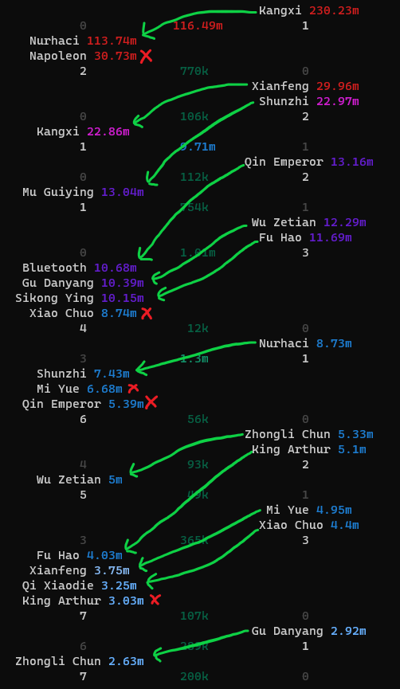

# Powering to beat a player
> [UE42] Marches

If you want to power to beat a particular player (e.g. those you expect to be your 40%), it's often more complicated than just powering a minister.

For example, if you have a 10m and 5m minister, and the other player has a 15m and 7m minister, then powering your 10m minister to 16m or your 5m to 8m means you will still beat only one of the two ministers. Expand this problem to twenty-five ministers, and it can be tricky to figure out the least power you need to beat an extra minister.

To solve this, rather than looking at individual ministers, you need to look at plugs of ministers.

A minister "plug" is a continuous set of ministers grouped by power, where each group starts and ends at an enemy minister. This can be visualised like:

Ideally, ministers will be used against those in the next enemy plug to them - your strong ministers will kill the other player's strong ministers, your medium-strength ministers kill their medium strength ministers, etc.

Using this visualisation, we can see which minister kills what, and where the deficits are being created.

A common move would be for the right player to power their 29.96m Xianfeng to defeat the left player's 30.73m Napoleon, but this wouldn't increase the number of ministers they are able to kill.

This is because now Xianfeng is attacking Napoleon, Shunzhi must attack Kangxi rather than Mu Guiying, Qin Emperor must attack Mu Guiying rather than Bluetooth... and this shift continues, but there is no minister spare to attack Sikong Ying; the same amount of ministers are being killed.

This introduces us to the concept of a _post-plug surplus_.

## Post-plug surplus
A post-plug surplus is how many ministers you have available to kill your opponent's ministers at the end of your plug. In the earlier images, this is the white number below the last minister of each plug.

To not create a deficit, you must have a post-plug surplus that is at least as large as the size of your opponent's next plug.

For example, the right player's Wu Zetian-Fu Hao plug has a post plug surplus of three, whereas the left player's next plug has four ministers in it. That means there is a deficit in this area, and you won't be able to kill extra ministers by powering the ministers in that plug and above.

_The post-plug surplus is three here, because there are two ministers in the plug, and Qin Emperor is free from an earlier plug because he has not been assigned an enemy minister yet._

With this in mind, the right player could kill two extra ministers with the following power increases:

Powering the Li Bai alone will result in an extra kill, because the plug he resides in has a surplus (since it is the last/weakest plug), so no deficit is created because he already can't kill anything.

The second power chain (Gu Danyang, Napoleon, Li Bai, and Shakespeare) has more because after Gu Danyang powers, the other ministers need to power to kill what each one before them killed before.

