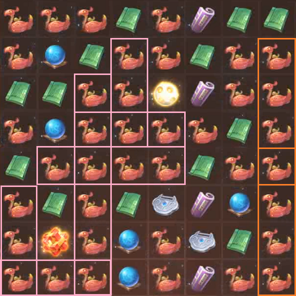
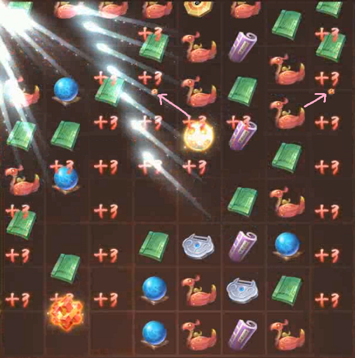

# Where do Red Burrs appear?
> [UE42] Marches

When a Red Burr is created by a direct move (i.e. immediately after making a move), it will appear where you moved the burr to complete the 5x. When it is created by a combo (i.e. the moves that occur _after_ your move, due to the holes created), it will appear in a different place.

To understand where it will appear, we need to define how a Red Burr is actually created.

### Matches
A _match_ is three or more of the same type of ball that are next to each other, either horizontally or vertically.

## Chains
A _chain_ is two or more matches that intersect on a _single_ ball.

In this case, the golds form a chain because there are two matches on a single ball (the reversed L-shape).

The silvers do because, as a neighbouring four-match sharing a ball with a three-match, they intersect on a single ball.

The purples do not, because they intersect on _two_ - the centre purples.

## Red Burrs
A Red Burr is created when a chain is created. The typical explanation is "it's five in a row but can also be an L or a plus". This definition, however, doesn't suffice for chains that are made up of more than two matches.

For example, this is a board that came about by using a Switch Stone:

Going by the typical definition, you would expect many Red Burrs to be created. In reality, only _two_ are, because there are only two chains here.

## Where do Red Burrs appear?
For a given chain created by a combo, the Red Burr will appear at the _highest_ ball of the entire chain. If there are many balls at the top, it will appear in the _leftmost_ ball of that set.

_Note: the "Red Burr appearing" animation plays while balls are falling, so it looks like it appears lower than it actually does._